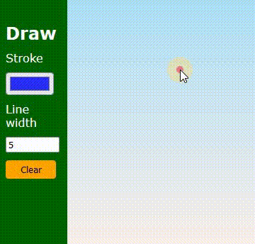

# 🛠 JS - drawing app

# 🔗 [Live Preview](https://6368373a45f9a9271e0a3f0c--harmonious-centaur-20b3d3.netlify.app/)

## Welcome! 👋

- This app let's you draw freely on the screen and if you made a mistake you can erase everything. Doing this guided project I try to understand JS and how to use conditional statements and event listeners 

### Languages and features 👨‍💻 

- JS: conditional statements.

Thanks for checking out my projects